# May 29: Case work, lipo soldering
Grab the different PCB, because JLC PCB gave me five of them when ordering. What I did was I've resoldered with SMD work, which took about 30 minutes, getting another hot plate from our chemistry lab. After that, I decided to start desoldering the stuff, so I asked one of our shop teachers how to desolder. He went through a little guide on how to solder properly, and after about an hour or so of work, I desoldered all the switches from that. I took the desoldered switch and resoldered them back onto the new board.

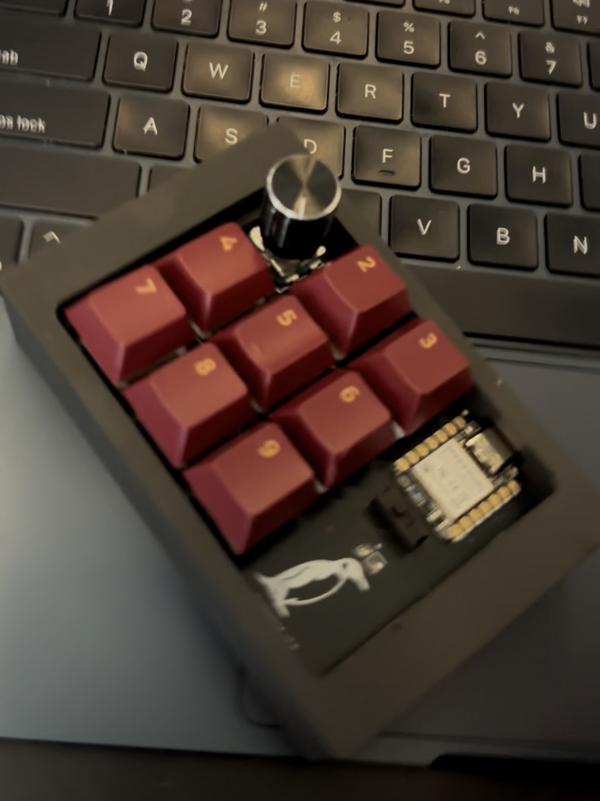

**Total time spent: 1 hours**
# May 28: redid smd, desoldered
Grab the different PCB, because JLC PCB gave me five of them when ordering. What I did was I've resoldered with SMD work, which took about 30 minutes, getting another hot plate from our chemistry lab. After that, I decided to start desoldering the stuff, so I asked one of our shop teachers how to desolder. He went through a little guide on how to solder properly, and after about an hour or so of work, I desoldered all the switches from that. I took the desoldered switch and resoldered them back onto the new board.

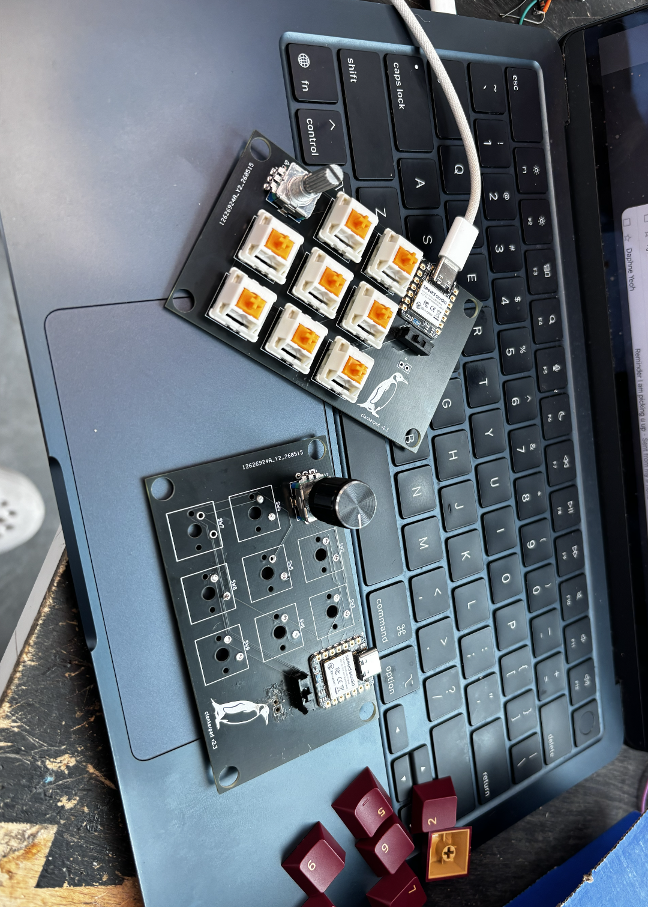

**Total time spent: 1.5 hours**
# May 22: Case is done + PCB work (and some pcb frying)
My PCB and stuff arrived, so I did a lot of work on that. I ran into a few main issues. My first issue is I don't know how to SMD solder. Luckily my school ordered solder paste, so after about an hour. After an hour of re-soldering and desoldering because I don't know how to use surface mount soldering, I ended up getting it to work, so I was really happy about that. After that, I was connecting the stuff and I was connecting my lipo battery, and while soldering my lipo battery together, I accidentally shorted it, because one of the wires came out. So now that one of the wires came out and it was shorted, I tried to take out the battery. Then, because I was really smart and I was really lazy, I decided I was going to drill a hole through my PCB to get rid of the solder instead of desoldering, because desoldering globs is really hard. So then after that, I tried using a different battery pack because I had a battery pack that wasn't rechargeable in LiPo battery. What I realized was that I had actually ruined the PCB, and I would have to completely restart. All my work putting all the keys on was essentially for nothing. 

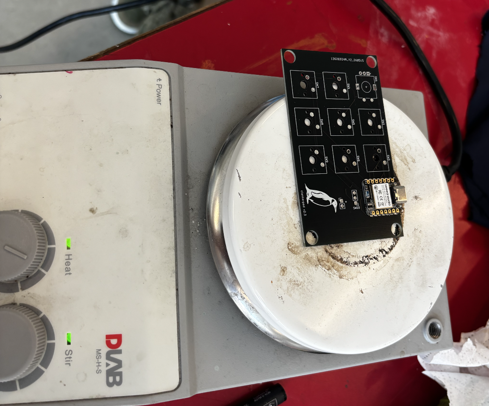
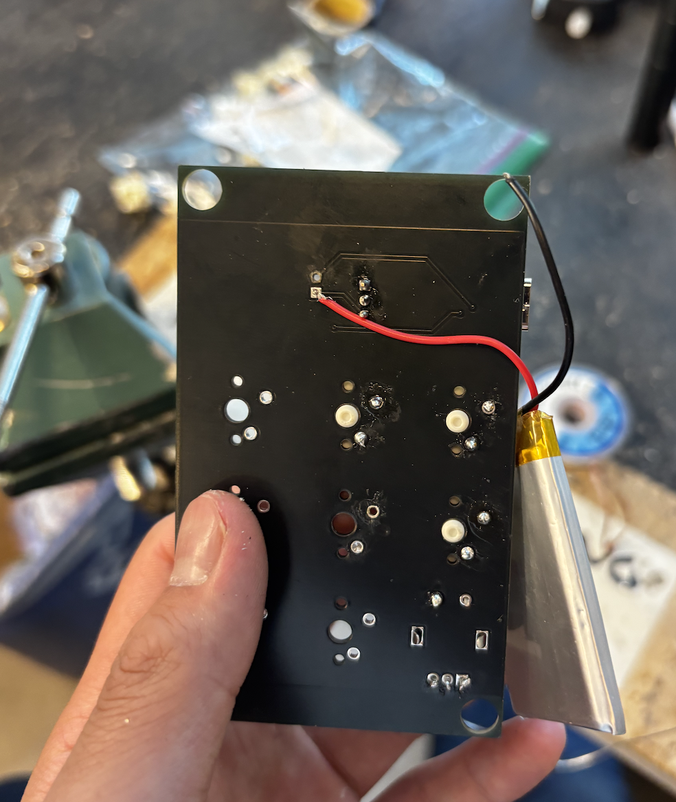
**Total time spent: 3 hours**
# May 21: CASE IS ALMOST FULLY DONE!!
This is so incredibly impressive how badly I messed it up. I managed to print my PCB, with my measurements for screw holes set at 3 mm for M3, but i set it as radius. oml. anyways, I fixed it, and finished designing the rest of the case (i hope) I still need to add my line to where my 3d print is split in two, so it can print properly. Had to spend about an hour on a call with my friend (who knows cad) on how to actaully get my models to work (spoiler alert don't use capture position). Today I learned how section analysis works, how to use projections properly, that I need to check every measurement 5 times before sending it off to the manufacturer otherwise ill mess up screwholes again. 

Also my really scuffed solution to the screw hole issue was to make a sandwich and hope that the tolerences don't get messed up and can actaully hold the PCB in place without breaking. (we will find out once i print). I think I will use glue to bind the two parts of the print together.

(PS i had some more time i didnt log and won't but the other day i had to spend a lot of time figuring stuff out on how im going to do SMD because i didn't realize how small it was, and i have no idea how to use paste pls help cus i have NO clue how im going to go about getting the bottom battery pads to solder). Tldr: i dont know how to do SMD, and our school bought more solder paste and we will hope and pray for the best.

Next steps: Finish case fully, and add holes, double check, and try to figure out how to use a 3d printer.
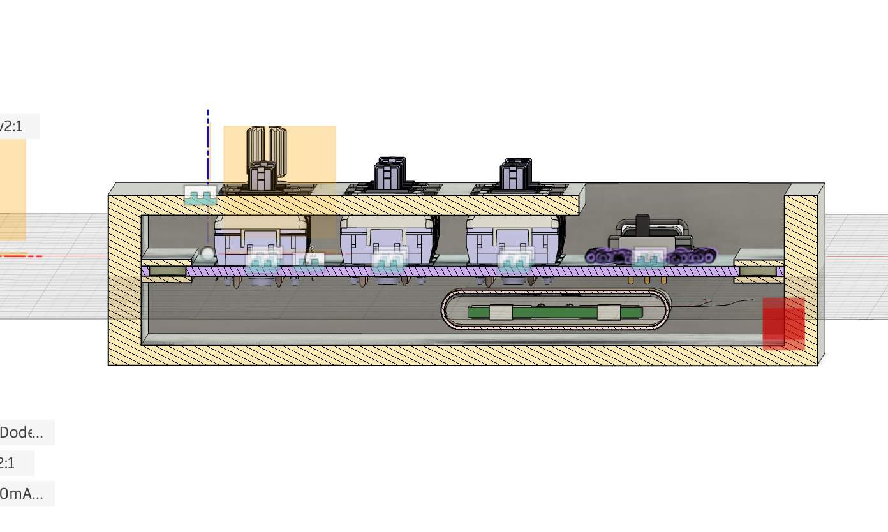
**Total time spent: 1.5 hours**
# May 15: CADDED
Guess who isnt good at rigid bodies. Me! I kept doing the same thing over and over again, wondering why it wasnt rigid, then realized I was selecting the wrong one... Anyways, I added all my switches, added the rotrary encoder, lipo battery, and on off switch.

Next steps: Finish the case

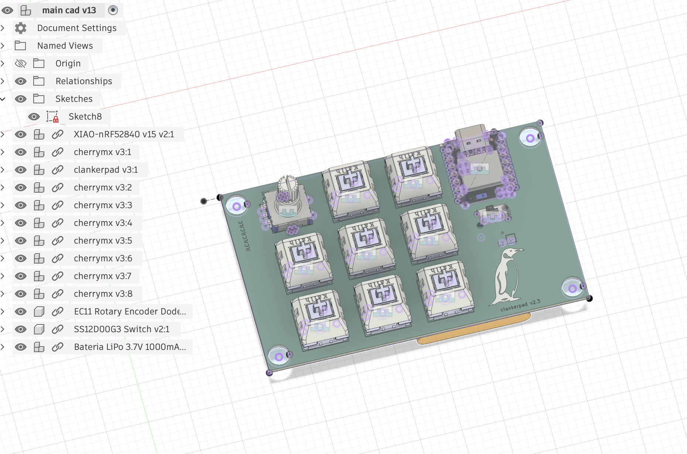
**Total time spent: 0.75 hours**
# May 14: ordered PCB (YAY) and then added routing holes. 
Title speaks mainly for itself. Took forever to add because I spent like 30 mins alone (didn't add to total time because atp this level of stupidity shouldnt count) on getting the stupid file to upload to JLCpcb. Guess the issue. I didn't have an account. Apparently by not having an account, uploading gerber files doesn't even work properly... (im really slow i don't really know how to use fusion)

Next steps: Finish CAD

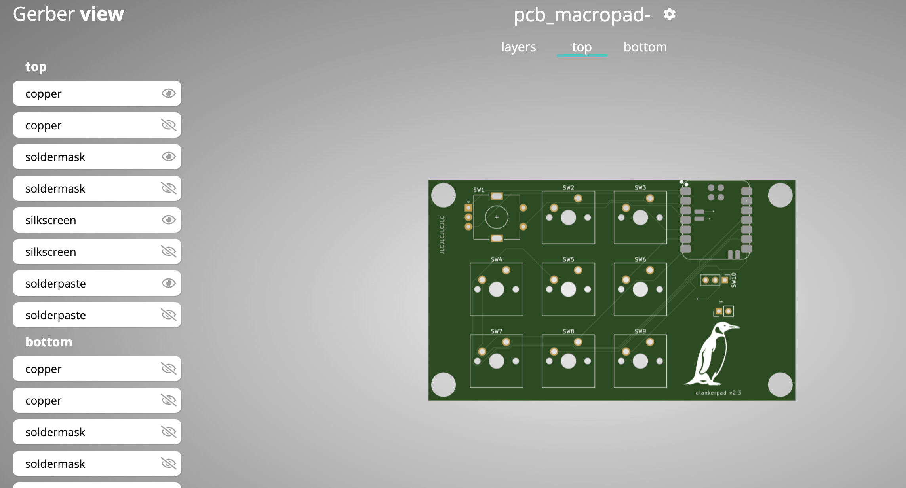
**Total time spent: 0.5 hours**
# May 13: Started to learn CAD a bit, and worked on cadding a little
I have no idea to learn cad. Well okay thats a bit of a lie, I have had about 45 minutes of lessons. Regardless, I forgot almost all of it, almost cried while trying to import my STEP file into fusion (i couldn't figure out how to make rigid bodies). Then i crashed out while looking for 3d models of cherry mx switches that don't have 5 pins (i was picky). 
Next step: Order PCB & CAD more
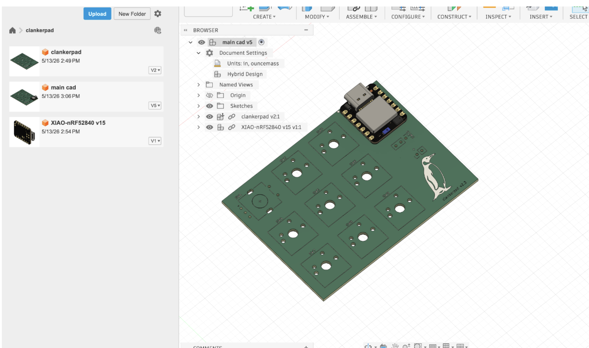
**Total time spent: 1 hours**

# May 12: Added a switch (I realized that because its bluetooth it should prob have a power off switch so it doesnt drain)

Title kinda speaks for itself, I had the brilliant realization that theres a reason bluetooth products have well an off switch. So i added one. Also I finalized and checked with HC members to sign off to check it would work!

Next step: Order PCB & CAD

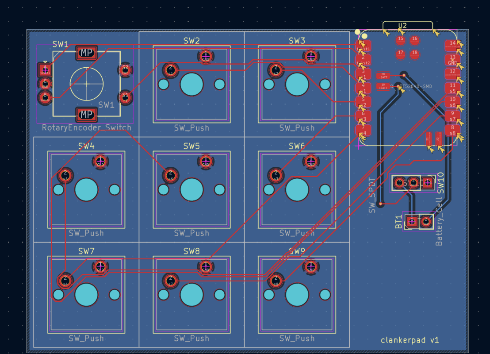
**Total time spent: 0.25 hours**
# May 11: Learned how to edit a schematic (i hate speedstudio) and i messed up again
So it turns out between my sickness and lack of sleep I think i butchred it again. For some reason i thought I should be using a xiao s3, but in actauality i should have been using a XIAO nRF52840. Ima be honest i have ZERO clue where i came up with it, but while trying to debug my S3 work, and talking to someone on hack club, they pointed out the fact that I was using very overkill parts, and frankly not correct (goated asl)

I DID IT THERE ARE NO MORE ERRORS I HAD TO TEACH MSYELEF HOW TO EDIT A SCHEAMTIC BUT I DID IT (editor leo context: xiao messed up their schematics and footprints, so i had to learn how to manually edit a schematic and their pin numbers to make it align with the footprint, and then had to reroute the entire thing again.)
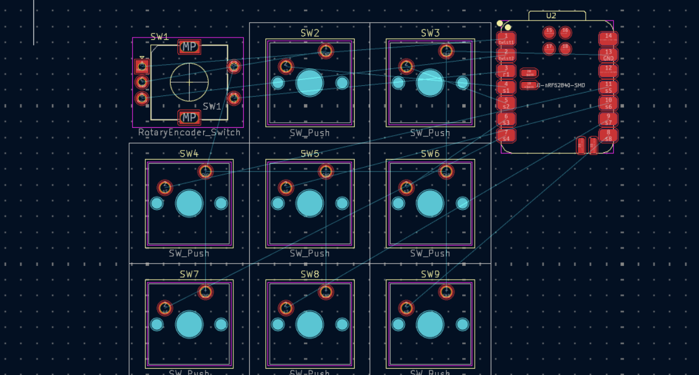
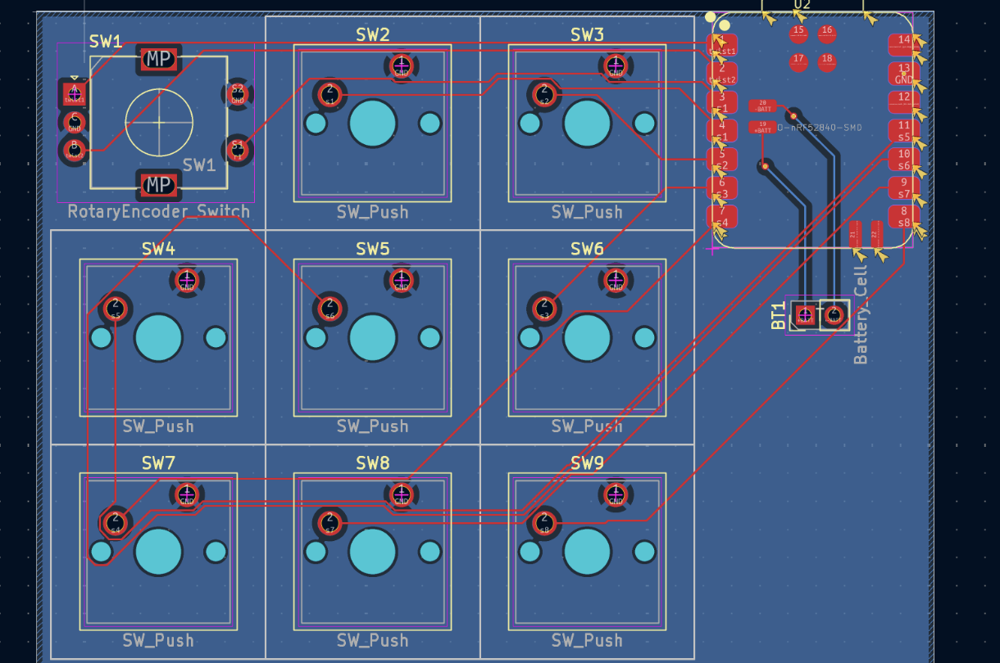

Next steps: Check PCB with hackclub

**Total time spent: 1 hours**

# May 9: PCB design hell

This log is very disorganized and borderline dysfunctional because im editing it like 7 times and just using it as a running log rather

TIL that my esp32 board wont work, and I will need to piviot to a different board with the same chip the xiao s3. This is because I would have otherwise needed to buy a separate converter for my voltage, and between shipping and lead times, it would make more sense (and would be cheaper) to buy a brand new board, the s3. This actually removes my need for the voltage regulators and would remove a USBC port that I would have otherwise needed (1 for flashing 1 for charging), and removes the risk of me blowing up my converter (if you flash you cant have battery power otherwise the battery manager goes kaboom).

Also at first i thought it would be the c3, then i learned it isn’t, and needs to be an s3 (c3 doesn’t have usb keyboard support, but somehow has bluetooth).

Worked on pcb design

I think after a lot of work i routed my entire PCB. im going to put my errors in here because im lazy and am very tired (its 11 pm and ive been working for over 3 hours straight). The tldr is that the funny schematic im using doesnt line up with my second schematic (yeah i need 2 for some reason for the pcb and for the editor idk why) (in technical terms PCB vs schematic, or footprints vs symbol). Regardless things that should have lined up didnt, and I had to remap half of it, and ignore 9 errors. Its very janky but i need to look into it more and confirm (with real people not just claude) that this won’t blow up. :D also i may need a fuse but thats a funny thing for later.

Fun little thing I realized -- I didn’t read any of the Xiao’s spec sheet (which I 100% should have.) Luckily, turns out the lipo battery and the battery in power on the xiao have the exact voltage I need!

TLDR (Leos comments from days later):
- Learned how to design a PCB
- went through routing hell and how to make a schematic properly work
- accidently used two different chipsets (spoiler alert its not the last)

Next step: Fix all the DRC errors

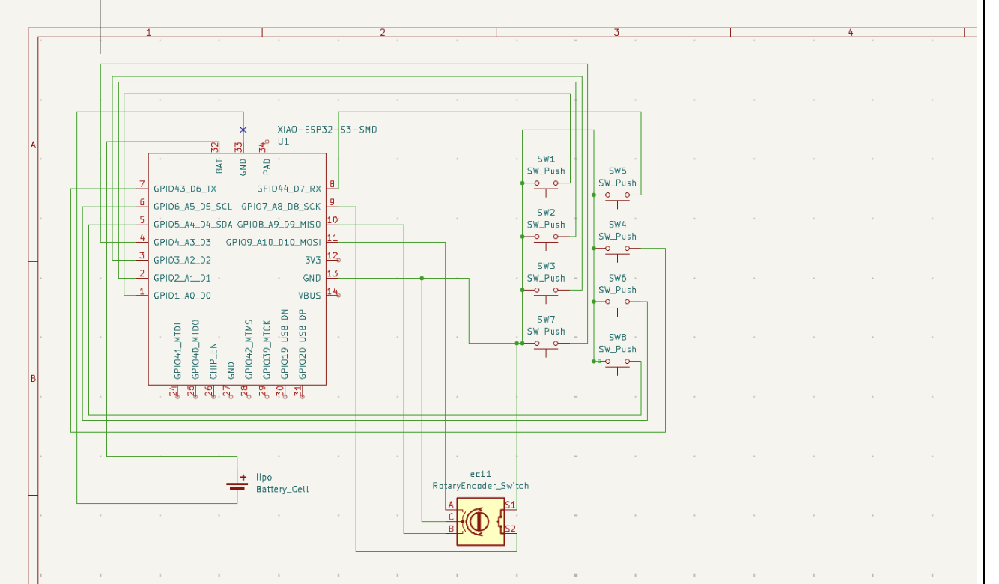
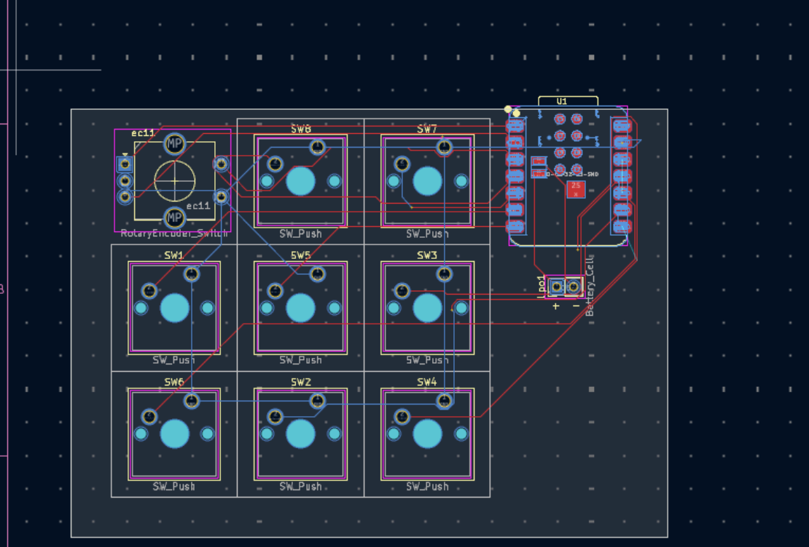
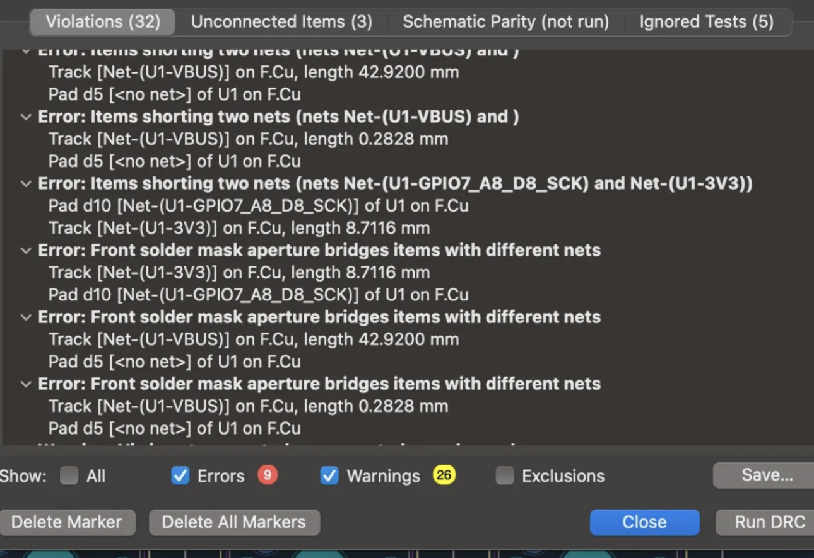
**Total time spent: 3.5 hours**

# May 5: Rotary encoders arrived!
Today I tested out rotary encoders, for volume (once again claude firmware), and button control! While I don't have a photo of it exactly, I have added a photo of the exact model I used (EC11)

Next Step: PCB (i kept lying to myself)

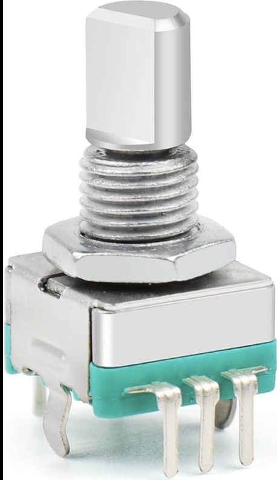
**Total time spent: 0.25 hours**

# May 1: Did a quick demo
Today I worked on my demo, where I concluded that connecting a GPIO pin to the switch to GND would work. While I was almost certain it would work, I double checked. I also used Claude for firmware, to test out the BLE functionality. 

The image below is not 100% accurate, but was the best I had im sorry :(

Next Step: PCB

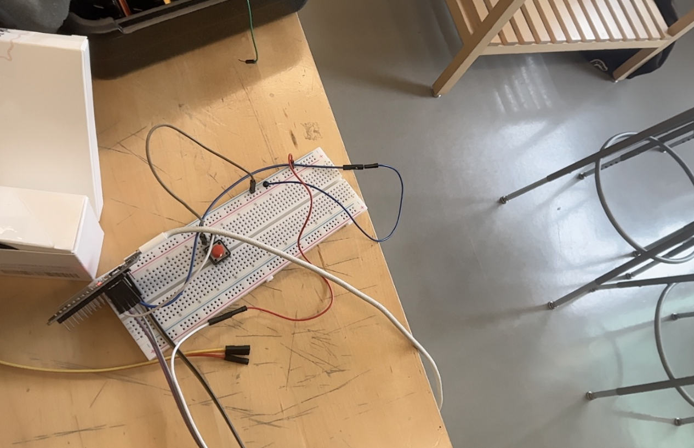
**Total time spent: 0.25 hours**

# April 28: Looked into parts 

Spent far too much time looking through guides and past projects (along with hackpad) to figure out what I was going to do for my macropad. I wanted it to stand out with bluetooth functionality, and knew that which keycaps and switches I would use (which I already had from building a custom keyboard previously). From there, I had just learned about ESP32s, and wanted to use it (Because I had learned about their bluetooth functionality). 

During this time, the main thing I learned was I would have to use a lipo battery, and then find a way to charge the lipo battery. A concern of mine is that I will fry the ESP if I power it (while flashing code) while also using the TP4056 for battery power.

- TP4056 - to power ESP 32 (be able to recharge and discharge from battery)
- 1000–2000mAh single cell 3.7V LiPo - actual battery
- ESP 32 
- PCB
- Switches 
- Keycaps
- Rotary knob (EC11)

Next Step: PCB

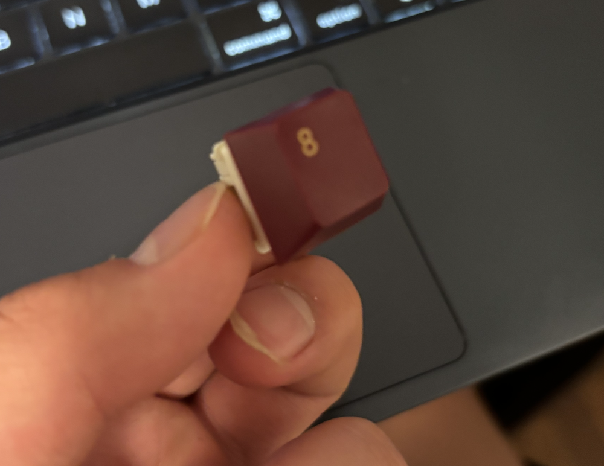

**Total time spent: 0.75 hours**
