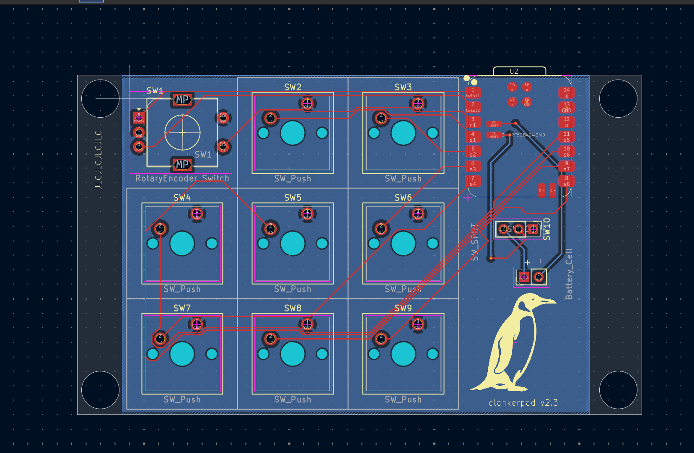
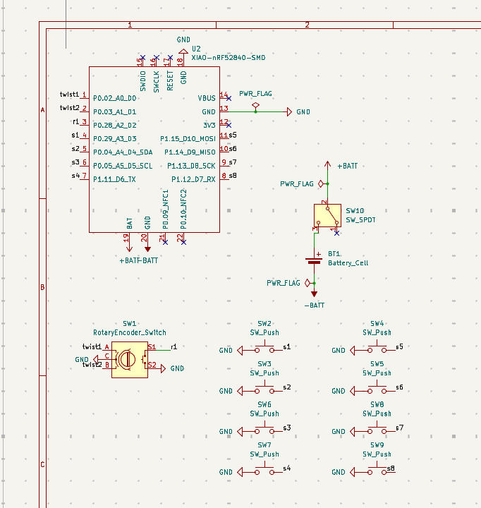

# Clankerpad
Clankerpad is a 8 switch + rotary encoder bluetooth macropad built on the ZMK supported Xiao nRF52840. Also my first big electronics project and custom pcb. I made this project because I am brand new to electronics, so I felt that this would be a nice fun challenging twist on a already really cool project.

# Firmware
https://github.com/amnotpopichu/clankerpad-zmk-config
Final link above, I did half of it, half of it was claude. I dont know how subrepos work, see my most recent journal entry, i hope this is ok.

# Images

# Disclaimer/Notes
I am importing most of this journal from a previous google doc that I had running for it. Times to do things may look crazy but i swear im not commiting fraud im just a bit stupid and this is my first project. If verb tense look weird, sorry, I am rewriting some entries to make it more clear (my old ones kinda sucked).

Images also may have disrepncies not logged, ie quick 15 minute rerouting, or small changes here and there to fix bugs, but I felt those wern't big enough to add a journal entry for.

There is a discrepncy between the created date in the yaml and the github repo. I have been working on this in a google doc for long before the repo. (I would be happy to send over proof if needed.)

Also links in my BOM may link to multi packs. I funded this project oustide of hackclub, so it may not reflect how many were actaully used. Some links are not the exact ones, as some parts were sourced in kit (aka just the black switch).

There are some questionable price choices, but this project was kinda rushed so I paid extra for shipping.

If there is some really odd journal entries, ie spending 3 hours on pcb design, sorry i didnt lapse i genuinely didnt know what that was until recently, i swear im not tryna fraud im just stupid lol

tldr: im not tryna commit fraud im js stupid and brand new :(

# Credits
Big thank you to everyone in HC that offered advice with my questions, and super huge thank you to [@JBlitzar](https://github.com/JBlitzar) and [@hekinav](https://github.com/hekinav)

|Name                       |Link                                                                                     |Quantity|Total cost                              |
|---------------------------|-----------------------------------------------------------------------------------------|--------|----------------------------------------|
|EC11                       |https://www.amazon.com/QSYZAIL-Rotary-Encoder-Compatible-Arduino/dp/B0G528SYTB/          |1       |8.87                                    |
|Xiao BLE                   |https://www.amazon.com/Seeed-Studio-XIAO-nRF52840-Sense/dp/B0DJ6NZVJT?th=1               |1       |35.99                                   |
|Generic 3 pin switch (SPDT)|https://www.amazon.com/Position-Vertical-Silver-Black-Available-Electronic/dp/B0DR2J8FY3/|1       |0 (self sourced)                        |
|pcb                        |N/A                                                                                      |1       |3.2                                     |
|tax                        |N/A                                                                                      |1       |0.31                                    |
|customs                    |N/A                                                                                      |1       |1.12                                    |
|Shipping                   |N/A                                                                                      |1       |32.88                                   |
|3d printed case            |N/A                                                                                      |1       |0 (self sourced)                        |
|Glorious Panda Switches    |https://www.amazon.com/Glorious-Panda-Switch-LUBED-GLO-SWT-HPANDA-LUBED/dp/B096DF64NS/   |8       |0 (taken from some that I already owned)|
|gmk samurai keycaps        |N/A                                                                                      |8       |0 (taken from some that I already owned)|
|jst connector for lipo     |https://www.amazon.com/dp/B013JRWCBU                                                     |1       |6.99                                    |
|lipo battery               |https://www.amazon.com/dp/B0867KDMY7                                                     |1       |18.99                                   |
